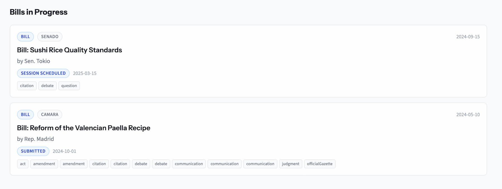
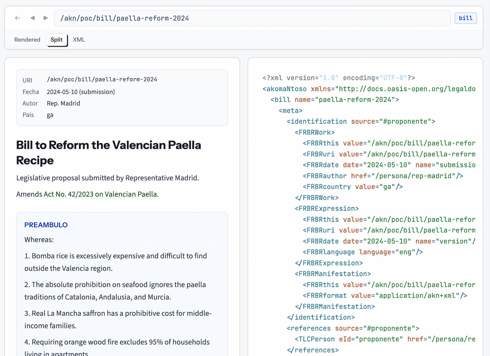

# Diff by Parlamento.ai

Proyecto de investigación que explora cómo representar el **rito parlamentario completo** usando [Akoma Ntoso](http://www.akomantoso.org/) como base.

Partimos de un problema concreto: no existe una herramienta pública para ver qué cambió cuando se modifica una ley. Para resolverlo, propusimos `AKN Diff`, una extensión que agrega un `changeSet` computable al estándar AKN. Pero la investigación nos llevó más lejos: a explorar si AKN puede ser la base de datos de un parlamento entero, a diseñar los tipos de documentos que le faltan al estándar, y a prototipar un portal legislativo 100 % basado en estas primitivas.


## Changelog

---
**19/02/2026**

Investigamos la **API JSON de LeyChile** (endpoint con versionamiento, catálogo de vigencias, anotaciones de modificación) y construimos tres nuevos casos reales para documentar distintos escenarios legislativos:

- **Ley 21.670 — Porte de Armas Aspirantes Policiales** (Boletín 15.995-02): primer boletín con tramitación completa — moción, 1er trámite (Cámara), 2do trámite con votación nominal del Senado (31-0-2) y ley publicada.
- **Boletín 17.370-17 — Cumplimiento Alternativo de Penas**: primer caso con votación de rechazo — moción de 4 artículos, modificada por Comisión de DDHH, rechazada en Sala del Senado (21-24).
- **Ley 21.120 — Identidad de Género** (Boletín 8924-07): primer caso con Comisión Mixta — la Cámara rechazó las modificaciones del Senado, activando la comisión bicameral. Incluye 6 votaciones de rechazo y la votación más estrecha del sistema (22-18).

Construimos un **pipeline automatizado para regulaciones de la UE**, con 10 PoCs reutilizables que descargan desde CELLAR, EP Open Data y EUR-Lex, convierten a AKN 3.0, y generan viewer XMLs. Procesamos **dos regulaciones**: Digital Services Act (74 → 93 artículos, 456 enmiendas EP) y AI Act (85 → 113 artículos, 770 enmiendas EP). Agregar una nueva regulación es crear un `viewer-config.json` y correr el pipeline.

([paso a paso](research/2026-02-19/README.md), [documentación pipeline](research/2026-02-19/akn-eu/docs/pipeline.md))

---
**18/02/2026**

Aplicamos AKN Diff a legislación real por primera vez: la **Ley 21.735 — Reforma de Pensiones** (Boletín 15.480-13), con 350 artículos, 5 normas modificadas y votación nominal del Senado (40-7). Como segundo caso, reconstruimos la **historia completa de la Ley 18.045** (Mercado de Valores) con 32 versiones en 44 años y 431 cambios. ([paso a paso](research/2026-02-18/README.md))


---
**10/02/2026**

Surgieron dos preguntas, qué quisimos responder:
1. ¿Cómo representar el hecho de que varios países nombran las cosas de forma distinta? ¿AKN tiene forma de representar eso?

> No necesitas "escribir todo en inglés y traducir en la interfaz". La solución de AKN es más elegante:
>
> 1. El XML usa elementos en inglés (forzado por el schema) — esto da interoperabilidad entre países
> 2. Los metadatos llevan los nombres locales (name, showAs, FRBRname) — esto da la localización
> 3. Tu interfaz simplemente lee el showAs para mostrar al usuario — no necesitas tabla de traducciones
> 
> Lo que AKN no resuelve (y que sería trabajo tuyo si lo necesitas): una ontología cross-jurisdicción que diga "Cámara de Diputados == House of Representatives == Camera dei Deputati". AKN te da el framework (TLCConcept con href apuntando a una ontología), pero no viene con el mapeo hecho. Si quieres que tu interfaz muestre "equivalencias" entre países, tendrías que construir esa ontología.

2. AKN solamente representa el dato como es. No comprende las reglas del rito parlamentario. ¿Habrá algún formato que nos permita transformar todo el proceso en algo fácil de leer por una máquina y un humano? Tal vez un formato para construir diagramas de decisiones o algo de ese estilo, que nos permita traducir las leyes legislativas de un país.

> 1. AKN = los documentos (qué se produjo)
> 2. BPMN = el proceso (cómo se mueven los documentos)
> 3. DMN = las reglas (por qué se toman las decisiones)
> Cada país tendría su modelo BPMN del rito parlamentario, con sus tablas DMN de reglas. Los nodos del proceso BPMN referenciarían los tipos de documentos AKN que se producen en cada paso. 

Después de investigar, llegamos a la conclusión de [este reporte](research/2026-02-10/bpmn-dmn-para-rito-parlamentario.md). La idea de poder representar los flujos legalmente a través de diagramas es totalmente factible y podría ser super interesante. Nos desvía un poco de la idea principal, por ende lo dejaremos en pausa por ahora. 


---
**04/02/2026**

La preocupacion de abrir la "caja de pandora" nos siguio dando vueltas por la cabeza. Decidimos ver que tan real era.

Despues de varias busquedas se llego a la conclucion que no seguia un effecto caja de pandora. Y que basicamente faltaban solo 2 tipos mas para englobar todo el rito parlamentario: `questions` y `comunications`.

`questions` es para las preguntas parlamentarias. Y `comunitactions` para la comunicacion oficial entre los organos.

No pasamos mucho tiempo diseñando cada tipo, priorisamos seguir avanzando en el experimento.

La próxima pregunta fue: ¿cómo podríamos rediseñar una página de un parlamento 100 % basado en las primitivas de AKN? En este caso, no estaríamos buscando re-inventar cómo funcionarían los links y todo eso, sino reemplazar lo existente y que funcione bastante similar. La única diferencia es que, atrás, todo está representado en AKN. 



El resultado fue nuevamente positivo. Navegar los distintos conceptos es bastante natural cuando todo esta bien conectado.

Lo que me sorprendio del POC es que podemos ver cuales boletines ya fueron citados para comission, es lo que se ve en el screenshot. Parece basico, pero no es como se ve muy comunmente.

Esto es gracias a que todo esta conectado por links como en la web. La citacion esta conectada al boletine mecanicamente.

La proxima pregunta es: que tan viable y juridicamente correctos son estos links.


Por ejemplo en este screenshot podemos ver el historial de un boletin, pero gracias a los links tambien marca las citaciones, mensages y debates.

De lo que vimos, al parecer no. El historial de un boletín es a título informativo. Y podríamos agregarle elementos a este historial, como las citaciones, o eventualmente cuando un boletín es mencionado.


---
**03/02/2026**

Viendo el buen resultado del proof of concept, rediseñamos toda la página para hacerla más accesible. Aún no lo publicamos abiertamente. El objetivo es crear un debate alrededor de estos temas.

También cambiamos el nombre a la extensión, ya no es AKN++ pero AKN Diff, porque se concentra únicamente en los cambios del comparado, nada más que eso. Y llamamos a este proyecto de research Diff by Parlamento.ai, de esa manera, englobamos todo bajo el nombre de "Diff".

Estamos agradablemente sorprendidos del formato Akoma Ntoso, se ve bastante completo y hecho con mucha dedicación para adaptarse a todos los tipos de parlamentos alrededor del mundo. 

Le vemos harto potencial. Incluso si el mundo decidió ignorarlo.

Se nos ocurrieron varias ideas que me gustaría explorar:
1. Tal vez los parlamentos deberían tener como base de datos un equivalente a S3 en vez de una DB relacional SQL, y que en ella se navigue como en la web, basada en links. Todo podía ser representado con AKN. En vez de tener `raws` y `columns` tiene archivos linkeados.
2. Podría usar el formato Git Para tener transparencia en las versiones y actualizaciones, en ese caso sería aún más simple que un S3 y sería una carpeta, con todo adentro. Se puede clonar por cualquiera. Serían básicamente archivos y carpetas, nada más.
3. Me gustaría hacer un visualizador de AKN online, algo donde podamos cargar estos archivos y poder visualizarlos de forma más bonita. Algo que englobe la totalidad del formato para poder explorar los tipos.
4. ¿Cómo podríamos convertir los datos actuales a este formato? Obviamente que con un trabajo manual monstruoso se podría hacer, pero eso no parece para nada viable. Habría que explorar workflows que combinen informática, inteligencia artificial y trabajo manual para reconstruir los datos.
5. Ver qué tan viable es AKN para ser el formato que englobe todo. A primera vista se ve bastante completo, pero tal vez, en realidad, es súper terco y difícil de trabajar y no se adapta a la realidad de los parlamentos. Explicaría el por qué nunca fue adaptado correctamente.

A raíz del punto 1 y 3 decidimos hacer un test de cómo podríamos hacer un visualizador en el cual podemos cliquear, como si fueran links, los distintos archivos AKN para poder navegar. El resultado es positivo: es agradable de navegar y el formato lo permite muy bien. Agregamos una nueva sección a la documentación para mostrar la versión renderizada y el XML bruto de cada uno de los tipos disponibles en AKN. 



Hicimos como si fuera un navegador web para ejemplificar aún más. En la imagen se puede ver la 'split view' en la que se ven el modo renderizado y el XML al mismo tiempo.

Siguiendo la misma idea, nos preguntamos cómo sería crear un portal web 100 % basado en AKN. Ver si un portal de algún parlamento, con todas sus distintas páginas y complejidades, podría ser representado con este formato solamente. 

Pienso esto para Parlamento.ai que necesita organización y queremos seguir varios parlamentos, pero también para crear un proyecto open source para cualquier parlamento que le gustaría tomar una interfaz ya trabajada y compatible con AKN.

Analizando cómo ver el problema, nos dimos cuenta de que no existía una forma ordenada de representar el "orden del día". La solución que propone el formato es hacer un documento genérico, que podría ser un reporte, una conclusión o una citación, pero no tiene un formato específico para la citación.

Investigamos un poco sobre por qué el formato no comprendía el concepto de "orden del día". La conclusión fue que AKN es un formato para archivar temas que son jurídicamente relevantes y que este concepto de citación vendría siendo algo de operación y no jurídico.

A raíz de esto, nos preguntamos si al querer embarcar el lado operativo del Parlamento, no estaríamos abriendo una caja de pandora de formatos y excepciones para cada Parlamento.

Pero después de reflexionar y buscar, vimos que la citación era el único concepto que realmente nos faltaba para cubrir todo el ritual legislativo. 

Decidimos no limitarnos por cómo funciona el formato AKN desde tan temprano. De todas formas, es un proyecto de búsqueda y exploración más que de implementación. Por ende, decidimos darle una oportunidad a nuestra idea de tipo "orden del día". 

Hicimos un primer test de cómo podría ser. [En este documento está detallado todo con las motivaciones](/Users/lb/work/diff-law/research/2026-02-03/citation-type-proposal.md), se nos ocurrió hacer un formato que también intente ser mecánicamente compatible con CalDAV, tal vez es un poco 'gadget', pero muestra la motivación a una máxima estandarización y compatibilidad.  

El formato aún merece revisión. 

---
**01/02/2026**

Con lo satisfactorio que se veía en el Proof of Concept, nos preguntamos por qué no abarcar más con este nuevo formato: ¿Cómo podríamos agregar la votación de cada cambio en la interfaz? Esto agregaría una nueva capa de visibilidad y transparencia.

El formato propuesto sería agregarle a nuestro `changeSet` el resultado final del voto, con los nombres. La razón de esto es porque, de la misma manera que los cambios, la votación en el formato actual simplemente es mencionada, pero en ningún momento se computa con un resultado final.

En el archivo `DEBATE.xml` solamente hacen el guión como en una pieza de teatro en la que dice "Senador Pérez: a favor". Pero en ningún momento se registra el voto final en el documento (e.g. `a-favor: 5, en-contra: 7`). 

Agregamos estos campos a nuestro `AKN Diff` formato, dentro del `changeSet`:

```md
  ┌─────────────────┬───────────────────────────────────────────────────────────────┐
  │    Elemento     │                           Propósito                           │
  ├─────────────────┼───────────────────────────────────────────────────────────────┤
  │ akndiff:vote    │ Consolida el resultado de la votación                         │
  ├─────────────────┼───────────────────────────────────────────────────────────────┤
  │ date            │ Cuándo se votó                                                │
  ├─────────────────┼───────────────────────────────────────────────────────────────┤
  │ result          │ approved, rejected, withdrawn, inadmissible, pending          │
  ├─────────────────┼───────────────────────────────────────────────────────────────┤
  │ source          │ Referencia al documento debate donde está el detalle completo │
  ├─────────────────┼───────────────────────────────────────────────────────────────┤
  │ akndiff:for     │ Lista de votantes a favor                                     │
  ├─────────────────┼───────────────────────────────────────────────────────────────┤
  │ akndiff:against │ Lista de votantes en contra                                   │
  ├─────────────────┼───────────────────────────────────────────────────────────────┤
  │ akndiff:abstain │ Lista de abstenciones (vacío si no hay)                       │
  ├─────────────────┼───────────────────────────────────────────────────────────────┤
  │ akndiff:voter   │ Cada persona, con href (ID único) y showAs (nombre legible)   │
  └─────────────────┴───────────────────────────────────────────────────────────────┘
```

El resultado en la interfaz es bastante atractivo:


---
**31/01/2026**

Después de los descubrimientos bien pesimistas de ayer, decidimos irnos más en profundidad en este formato maravilla llamado *Akoma Ntoso* (AKN).

Es un formato bastante grande que engloba el ritual legislativo prácticamente por completo, basado en XML, siendo actualizado por un organismo de buena reputación en estándares.

Pero tiene dos problemas.

El primero es que nunca fue realmente adoptado y muchos países optaron por sus propias implementaciones basadas en XML.

El segundo problema es que, si bien es muy completo, no tiene el concepto de un comparado, solamente comprende el `AMENDMENT` que básicamente es el cambio escrito en lenguaje natural, pero que no es computable para generar un comparado de forma automática.

La razón por la cual no tiene un comparado como un tipo nativo es que, en realidad, el comparado no tiene lugar oficial en el ritual legislativo. Lo que cuenta es el `AMENDMENT`, y luego cada uno calcula el comparado por su lado, y tal vez esa es la raíz del problema.

Aquí un resumen que ejemplifica el problema:
```md
  La analogía: una receta de cocina

  Imagina que tienes una receta de cocina publicada en un libro (la ley vigente). Alguien propone cambiarla (el proyecto de ley). El proceso sería:

  1. La receta original (en el libro)     → ACT
     "Agregar 100g de azúcar"

  2. Alguien dice "hay que cambiarla"     → BILL
     "Propongo reemplazar 100g por 50g"

  3. La comisión de cocina la discute     → DEBATE
     "Juan dijo que 50g es muy poco..."

  4. Votan y aprueban con cambios         → AMENDMENT
     "Mejor que sean 75g"

  5. La receta actualizada (nuevo libro)  → ACT (nueva versión)
     "Agregar 75g de azúcar"

  El comparado sería una hoja que pone lado a lado:
  ┌────────────────────────┬───────────────────────┐
  │    Receta original     │     Receta nueva      │
  ├────────────────────────┼───────────────────────┤
  │ Agregar 100g de azúcar │ Agregar 75g de azúcar │
  └────────────────────────┴───────────────────────┘
  Esa hoja no existe como tipo de documento en AKN. Es algo que tú produces para que la gente entienda qué cambió.
```

Lo que se nos ocurrió es aumentar el formato AKN Para poder agregar los cambios computados. La primera idea fue crear un nuevo tipo `RED-LINE` dónde vivirían los comparados. La segunda idea que vino, que nos pareció mucho mejor, fue aumentar cada uno de los tipos para agregarles la manera de representar el cambio computado.

Decidimos llamarlo `AKN Diff`.

Este es un ejemplo del `AMENDMENT`, pero con el nuevo campo `changeSet`:

```xml
  <amendment>
    <!-- El "mensaje del commit" (lo que ya existe en AKN) -->
    <amendmentBody>
      <amendmentContent>
        <p>Reemplázase en el artículo 1 la frase "100g de azúcar"
           por "75g de azúcar"</p>
      </amendmentContent>
      <amendmentJustification>
        <p>Porque 100g es demasiado dulce.</p>
      </amendmentJustification>
    </amendmentBody>

    <!-- El "diff" (lo que NO existe en AKN y tú propones agregar) -->
    <changeSet
      base="/receta/v2"
      result="/receta/v3">
      <articleChange article="art_1">
        <old>Agregar 100g de azúcar</old>
        <new>Agregar 75g de azúcar</new>
      </articleChange>
    </changeSet>
  </amendment>
```

Este campo se le agregaría a cualquier tipo que pueda modificar la ley textualmente, como, por ejemplo el `BILL`.

Con este sistema podemos cargar un `AMENDMENT`, gracias a los links volver al inicio (`ACT`), y volver a construir todos los cambios computados para saber el comparado actual de forma automática.

En teoría, debería poder funcionar; si bien hay casos en los que se juntan varios cambios de una y se cambian de una forma un poco opaca. También está el caso donde deciden reemplazar toda una sección por una nueva o deciden reordenar los números de un artículo. El resultado no sería el más bonito o más práctico, pero sería algo.

Para esos casos, se podría complejizar un poco más el formato, agregando cambios por línea y cosas de ese estilo:

```xml
  <articleChange old="art_24" new="art_22" type="renumber+modify">
    <old>...</old>
    <new>...</new>
  </articleChange>
  <articleChange old="art_25" type="repeal"/>
  <articleChange new="art_23" type="insert"/>
```

A partir de ese formato, construimos un proof of concept que parece funcionar bastante bien.


Realmente nos permite hacer un seguimiento mucho más agradable y comprensible. Ahora el ejemplo es una simple receta, no una verdadera ley. Faltaría ver cómo funciona con más datos.


---
**30/01/2026**

Lo primero que buscamos es explorar lo existente. Con un simple deep research ([primera búsqueda](research/2026-01-30/primera-busqueda.md)) vimos que hay muchas cosas existentes y que varían bastante de país en país. Decidimos hacer una búsqueda para cada país para tener mucho más detalle sobre las propuestas e implementaciones ya vigentes (ver [research por país](research/2026-01-30/country)).

Después de analizarlas, llegamos a una conclusión bastante similar a la que generó la AI:
> La conclusión transversal: **ningún país ofrece comparados legislativos en formato estructurado y legible por máquina**. Incluso UK y USA, que tienen la mejor infraestructura, mantienen sus herramientas de comparación como internas o limitadas a leyes ya promulgadas. El gap que motivó este proyecto es real y universal.

La segunda mala noticia después de esta primera búsqueda, es que **muchas herramientas no están abiertas al público**. ¿Tal vez son propuestas que quedaron en el aire y nunca se implementaron? O tal vez sí están bien implementadas, pero solo los miembros de los congresos tienen acceso y, por ende, no podemos verificar y probar esas implementaciones. Si al final del proceso el público solamente tiene acceso a un PDF, consideraríamos que no está implementado.

El tercer aprendizaje fue la existencia del formato `AKN/LegalDocML`, lo cual **parece ser exactamente la respuesta al problema**. Un formato universal basado en `XML` para el mundo legislativo. Pero prácticamente ningún Parlamento lo ha implementado correctamente, Y aun peor, cada uno implemento su propia version basada en `XML` alejándose del estándar.
