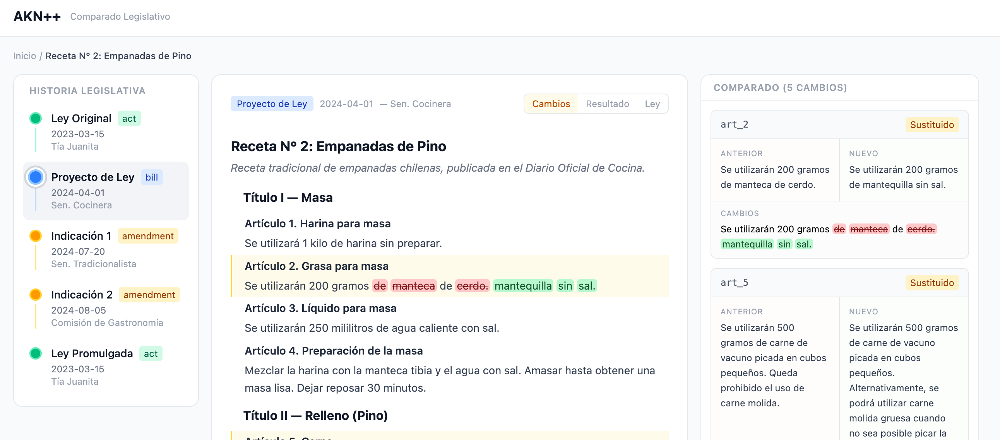

# diff-law

Herramienta para generar **comparados legislativos** de forma automática. El problema que resolvemos es simple: cuando se modifica una ley, no existe un formato estándar ni una herramienta pública que permita ver lado a lado qué cambió. Cada parlamento hace lo suyo, muchos solo publican PDFs, y el ciudadano queda a ciegas.

Nuestra propuesta es `AKN++`, una extensión del estándar [Akoma Ntoso](http://www.akomantoso.org/) que agrega un `changeSet` computable a los documentos legislativos, permitiendo reconstruir el comparado de cualquier modificación de forma automática.

## Setup

```sh
npm install
```

## Desarrollo

```sh
npm run dev
```

## Build

```sh
npm run build
```

---

## Changelog

---
**31/01/2026**

Después de los descubrimientos bien pesimistas de ayer, decidimos irnos más en profundidad en este formato maravilla llamado *Akoma Ntoso* (AKN).

Es un formato bastante grande que engloba el ritual legislativo prácticamente por completo, basado en XML, siendo actualizado por un organismo de buena reputación en estándares.

Pero tiene dos problemas.

El primero es que nunca fue realmente adoptado y muchos países optaron por sus propias implementaciones basadas en XML.

El segundo problema es que, si bien es muy completo, no tiene el concepto de un comparado, solamente comprende el `AMENDMENT` que básicamente es el cambio escrito en lenguaje natural, pero que no es computable para generar un comparado de forma automática.

La razón por la cual no tiene un comparado como un tipo nativo es que, en realidad, el comparado no tiene lugar oficial en el ritual legislativo. Lo que cuenta es el `AMENDMENT`, y luego cada uno calcula el comparado por su lado, y tal vez esa es la raíz del problema.

Aquí un resumen que ejemplifica el problema:
```md
  La analogía: una receta de cocina

  Imagina que tienes una receta de cocina publicada en un libro (la ley vigente). Alguien propone cambiarla (el proyecto de ley). El proceso sería:

  1. La receta original (en el libro)     → ACT
     "Agregar 100g de azúcar"

  2. Alguien dice "hay que cambiarla"     → BILL
     "Propongo reemplazar 100g por 50g"

  3. La comisión de cocina la discute     → DEBATE
     "Juan dijo que 50g es muy poco..."

  4. Votan y aprueban con cambios         → AMENDMENT
     "Mejor que sean 75g"

  5. La receta actualizada (nuevo libro)  → ACT (nueva versión)
     "Agregar 75g de azúcar"

  El comparado sería una hoja que pone lado a lado:
  ┌────────────────────────┬───────────────────────┐
  │    Receta original     │     Receta nueva      │
  ├────────────────────────┼───────────────────────┤
  │ Agregar 100g de azúcar │ Agregar 75g de azúcar │
  └────────────────────────┴───────────────────────┘
  Esa hoja no existe como tipo de documento en AKN. Es algo que tú produces para que la gente entienda qué cambió.
```

Lo que se nos ocurrió es aumentar el formato AKN Para poder agregar los cambios computados. La primera idea fue crear un nuevo tipo `RED-LINE` dónde vivirían los comparados. La segunda idea que vino, que nos pareció mucho mejor, fue aumentar cada uno de los tipos para agregarles la manera de representar el cambio computado.

Decidimos llamarlo `AKN++`.

Este es un ejemplo del `AMENDMENT`, pero con el nuevo campo `changeSet`:

```xml
  <amendment>
    <!-- El "mensaje del commit" (lo que ya existe en AKN) -->
    <amendmentBody>
      <amendmentContent>
        <p>Reemplázase en el artículo 1 la frase "100g de azúcar"
           por "75g de azúcar"</p>
      </amendmentContent>
      <amendmentJustification>
        <p>Porque 100g es demasiado dulce.</p>
      </amendmentJustification>
    </amendmentBody>

    <!-- El "diff" (lo que NO existe en AKN y tú propones agregar) -->
    <changeSet
      base="/receta/v2"
      result="/receta/v3">
      <articleChange article="art_1">
        <old>Agregar 100g de azúcar</old>
        <new>Agregar 75g de azúcar</new>
      </articleChange>
    </changeSet>
  </amendment>
```

Este campo se le agregaría a cualquier tipo que pueda modificar la ley textualmente, como, por ejemplo el `BILL`.

Con este sistema podemos cargar un `AMENDMENT`, gracias a los links volver al inicio (`ACT`), y volver a construir todos los cambios computados para saber el comparado actual de forma automática.

En teoría, debería poder funcionar; si bien hay casos en los que se juntan varios cambios de una y se cambian de una forma un poco opaca. También está el caso donde deciden reemplazar toda una sección por una nueva o deciden reordenar los números de un artículo. El resultado no sería el más bonito o más práctico, pero sería algo.

Para esos casos, se podría complejizar un poco más el formato, agregando cambios por línea y cosas de ese estilo:

```xml
  <articleChange old="art_24" new="art_22" type="renumber+modify">
    <old>...</old>
    <new>...</new>
  </articleChange>
  <articleChange old="art_25" type="repeal"/>
  <articleChange new="art_23" type="insert"/>
```

A partir de ese formato, construimos un proof of concept que parece funcionar bastante bien.



Realmente nos permite hacer un seguimiento mucho más agradable y comprensible. Ahora el ejemplo es una simple receta, no una verdadera ley. Faltaría ver cómo funciona con más datos.


---
**30/01/2026**

Lo primero que buscamos es explorar lo existente. Con un simple deep research ([primera búsqueda](research/2026-01-30/primera-busqueda.md)) vimos que hay muchas cosas existentes y que varían bastante de país en país. Decidimos hacer una búsqueda para cada país para tener mucho más detalle sobre las propuestas e implementaciones ya vigentes (ver [research por país](research/2026-01-30/country)).

Después de analizarlas, llegamos a una conclusión bastante similar a la que generó la AI:
> La conclusión transversal: **ningún país ofrece comparados legislativos en formato estructurado y legible por máquina**. Incluso UK y USA, que tienen la mejor infraestructura, mantienen sus herramientas de comparación como internas o limitadas a leyes ya promulgadas. El gap que motivó este proyecto es real y universal.

La segunda mala noticia después de esta primera búsqueda, es que **muchas herramientas no están abiertas al público**. ¿Tal vez son propuestas que quedaron en el aire y nunca se implementaron? O tal vez sí están bien implementadas, pero solo los miembros de los congresos tienen acceso y, por ende, no podemos verificar y probar esas implementaciones. Si al final del proceso el público solamente tiene acceso a un PDF, consideraríamos que no está implementado.

El tercer aprendizaje fue la existencia del formato `AKN/LegalDocML`, lo cual **parece ser exactamente la respuesta al problema**. Un formato universal basado en `XML` para el mundo legislativo. Pero prácticamente ningún Parlamento lo ha implementado correctamente, Y aun peor, cada uno implemento su propia version basada en `XML` alejándose del estándar.
